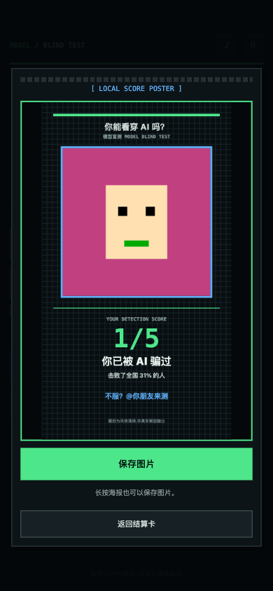

# combos-examples

Games created on [Combos](https://combos.converge.ai) **entirely by an AI coding agent driving the platform's Boo editor agent** — no hand-written game code. Each example ships with its full creation spec, delivery report, version (hash) chain, and verification evidence.

> This repository will grow to hold multiple examples. It starts with two, built in one day.

| 模型大乱斗 Model Brawl | 模型盲测 Model Blind Test |
|---|---|
|  |  |

## Examples

| Game | One-liner | Play | Hashes | Key lessons inside |
|---|---|---|---|---|
| [模型大乱斗 Model Brawl](examples/model-brawl/) | One-button AI-model fighting, 20s rounds, meme KO cards | [▶ play](https://combos.converge.ai/deploy/gamepreview/9f5eed603879d8c248ae5103fc1dc275/?project_id=2084127527297781760) | 9 | Slate message fragmentation incident; desktop input-mapping bug invisible to Boo's own smoke test |
| [模型盲测 Model Blind Test](examples/model-blind-test/) | Guess which AI model wrote the answer; face-cam + selfie score poster | [▶ play](https://combos.converge.ai/deploy/gamepreview/356eea59743a2d8b547eaa92a4a8b802/?project_id=2084252752023748608) | 7 | Broken question-bank distribution; getUserMedia pending-forever ("clicked, nothing happened") root cause & fix |

## How were these built?

Read [docs/how-built-with-agent.md](docs/how-built-with-agent.md) — the full methodology: distribution-first design, spec templates, bounded Boo turns, independent browser verification of every hash, and the four real incidents that shaped the process.

Built with the companion skill: [combos-skills / combos-game-creator](https://github.com/convergeai-labs/combos-skills).

## A note on honesty

Both games are **style-imitation entertainment**: quiz answers are human-written parodies of model styles, not real model outputs, and the games carry a permanent visible disclaimer saying so. "击败了全国 X% 的人" is labeled pseudo-random theater, not a real leaderboard. No vendor logos are used anywhere.

## License

MIT (docs and specs). Screenshots are provided as verification evidence for reference.
