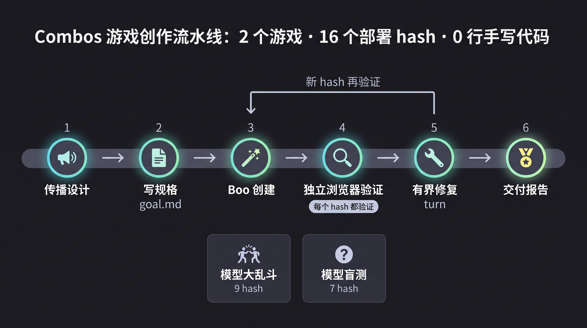
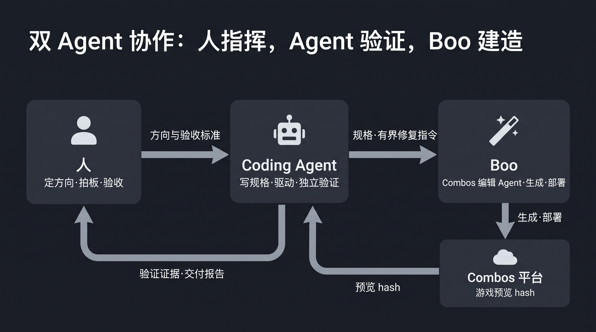

# combos-examples

**中文** | [English](README.en.md)

在 [Combos](https://combos.converge.ai) 上、**完全由 AI coding agent 驱动平台的 Boo 编辑 agent** 创作的游戏合集——没有手写一行游戏代码。每个示例都附带完整创作规格、交付报告、版本 hash 链和独立验证证据。

> 本仓库会陆续收录多个示例,当前是第一批:一天之内做出的两个游戏。

| 模型大乱斗 Model Brawl | 模型盲测 Model Blind Test |
|---|---|
|  |  |

## 创作流水线

每个部署 hash 都经过独立浏览器验证;验证不过就回炉,新 hash 再验证。两个游戏共 16 个部署 hash,0 行手写代码。

## 示例

| 游戏 | 一句话 | 试玩 | Hash 数 | 内含教训 |
|---|---|---|---|---|
| [模型大乱斗 Model Brawl](examples/model-brawl/) | 一键 AI 模型格斗,20 秒一局,KO 出梗结算卡 | [▶ 试玩](https://combos.converge.ai/deploy/gamepreview/9f5eed603879d8c248ae5103fc1dc275/?project_id=2084127527297781760) | 9 | Slate 消息拆段事故;Boo 自测不可见的桌面输入映射反转 bug |
| [模型盲测 Model Blind Test](examples/model-blind-test/) | 猜一段回答是哪个 AI 模型写的;全程出镜 + 自拍战绩海报 | [▶ 试玩](https://combos.converge.ai/deploy/gamepreview/356eea59743a2d8b547eaa92a4a8b802/?project_id=2084252752023748608) | 7 | 题库分布崩(一轮 4/5 同答案);getUserMedia 永久 pending("点了没反应")根因与修复 |

## 这些游戏是怎么做出来的?

读 [docs/how-built-with-agent.md](docs/how-built-with-agent.md) —— 完整方法论:传播设计先行、规格模板、有界 Boo turn、每个 hash 的独立浏览器验证,以及塑造了这套流程的四个真实事故。

配套 skill:[combos-skills / combos-game-creator](https://github.com/convergeai-labs/combos-skills)。

## 诚实声明

两个游戏都是**风格演绎的娱乐内容**:盲测题目的回答是人类按模型文风刻板印象写的段子,不是真实模型输出,游戏内常驻可见声明标注了这一点。"击败了全国 X% 的人"是标注过的伪随机演出,不是真实排行榜。所有素材不含任何厂商官方 logo。

## License

MIT(文档与规格)。截图作为验证证据提供参考。
