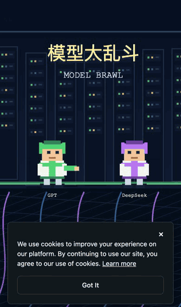
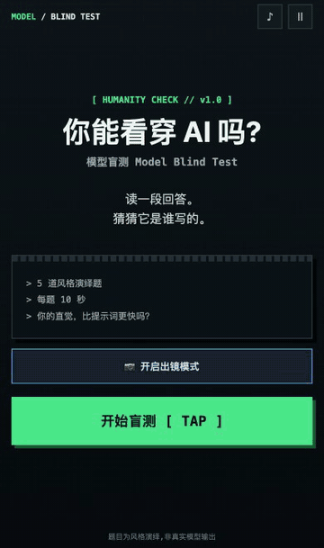

# combos-examples

**中文** | [English](README.en.md)

在 [Combos](https://combos.converge.ai) 上、**完全由 AI coding agent 驱动平台的 Boo 编辑 agent** 创作的游戏合集——没有手写一行游戏代码。每个示例都附带完整创作规格、交付报告、版本 hash 链和独立验证证据。

> 第一批:一天之内做出的两个游戏(像素格斗 + 终端盲测)。第二批(2026-08-25):风格多样性三连——水墨、霓虹、水彩,三个游戏全部**一次构建通过,0 修复 turn**。

## 最新:风格多样性批次

视觉风格 × 玩法机制 × 传播结构全部错开的三个游戏:

| 一笔签 One Stroke Fortune | 毫秒反应局 Millisecond Reaction | 灵魂汤底 Soul Soup |
|---|---|---|
|  |  |  |
| 国风水墨 · 画一笔抽运势签 | 霓虹合成波 · 灯绿瞬间点击 | 暖彩绘本 · 三步选择测汤底人格 |
| 输入:连续轨迹(画) | 输入:单发时机(毫秒) | 输入:离散选择(叙事) |
| [示例文档](examples/one-stroke-fortune/) | [示例文档](examples/ms-reflex/) | [示例文档](examples/soul-soup/) |

三个游戏均通过全门禁独立验证(状态机/双视口/0 控制台错误/诚实声明常驻),公开试玩链接将在 Post 发布后补充。

## 在线试玩(已发布)

无需安装,手机浏览器直接玩(匿名可玩):

| 模型大乱斗 Model Brawl | 模型盲测 Model Blind Test |
|---|---|
|  |  |
| 一键 AI 模型格斗,20 秒一局,KO 出梗结算卡 | 猜一段回答是哪个 AI 写的;全程出镜 + 自拍战绩海报 |
| [▶ 立即开打](https://combos.game/play/8dd0941ae0543fcccd0fc565a6ecaf3c) · 分享码 `58283` | [▶ 开始盲测](https://combos.game/play/ae82cf8ef3e7931e0008b02a2a7cebae) · 分享码 `89524` |

## 创作流水线

每个部署 hash 都经过独立浏览器验证;验证不过就回炉,新 hash 再验证。五个游戏共 19 个部署 hash,0 行手写代码。

## 示例

| 游戏 | 一句话 | 试玩 | Hash 数 | 内含教训 |
|---|---|---|---|---|
| [模型大乱斗 Model Brawl](examples/model-brawl/) | 一键 AI 模型格斗,20 秒一局,KO 出梗结算卡 | [▶ 试玩](https://combos.game/play/8dd0941ae0543fcccd0fc565a6ecaf3c) | 9 | Slate 消息拆段事故;Boo 自测不可见的桌面输入映射反转 bug |
| [模型盲测 Model Blind Test](examples/model-blind-test/) | 猜一段回答是哪个 AI 模型写的;全程出镜 + 自拍战绩海报 | [▶ 试玩](https://combos.game/play/ae82cf8ef3e7931e0008b02a2a7cebae) | 7 | 题库分布崩(一轮 4/5 同答案);getUserMedia 永久 pending("点了没反应")根因与修复 |
| [一笔签 One Stroke Fortune](examples/one-stroke-fortune/) | 宣纸上画一笔,抽你的 2026 水墨运势签 | Post 待发布 | 1 | 完整规格 = 一次构建 0 修复;UGC 钩子不靠相机靠笔迹 |
| [毫秒反应局 Millisecond Reaction](examples/ms-reflex/) | 灯绿就点,5 轮平均毫秒数定段位 | Post 待发布 | 1 | WebGL 游戏的外部验证:截图像素探针替代 getImageData |
| [灵魂汤底 Soul Soup](examples/soul-soup/) | 雨夜便利店三个选择,测你的灵魂汤底 | Post 待发布 | 1 | 确定性映射(27 路径→6 汤底)写进规格,Boo 原样实现 |

## 这些游戏是怎么做出来的?

读 [docs/how-built-with-agent.md](docs/how-built-with-agent.md) —— 完整方法论:传播设计先行、规格模板、有界 Boo turn、每个 hash 的独立浏览器验证,以及塑造了这套流程的四个真实事故。

配套 skill:[combos-skills / combos-game-creator](https://github.com/convergeai-labs/combos-skills)。

## 诚实声明

两个游戏都是**风格演绎的娱乐内容**:盲测题目的回答是人类按模型文风刻板印象写的段子,不是真实模型输出,游戏内常驻可见声明标注了这一点。"击败了全国 X% 的人"是标注过的伪随机演出,不是真实排行榜。所有素材不含任何厂商官方 logo。

## License

MIT(文档与规格)。截图作为验证证据提供参考。
