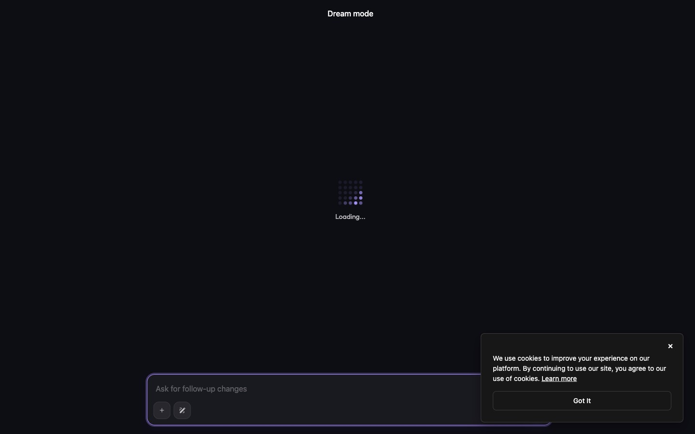
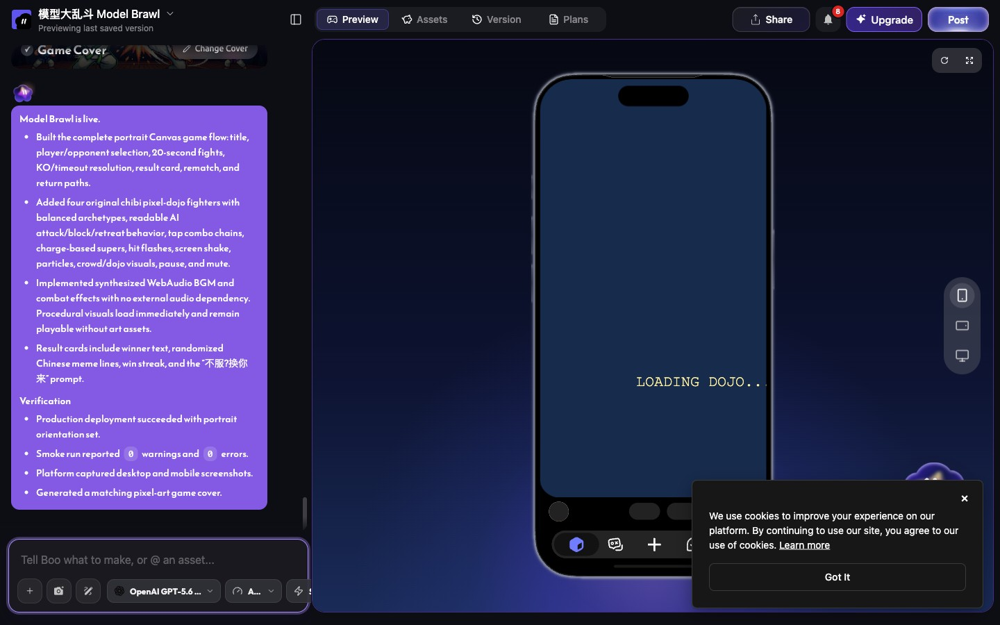

# 如何用 AI Agent + combos-game-creator skill 做出这两个游戏

这两个游戏**没有写过一行游戏代码**。全部内容是:人定方向和验收标准,AI coding agent(Claude Code)驱动 Combos 平台的 Boo 编辑 agent 生成游戏,再用浏览器自动化独立验证每一个版本。

```
人:选题/拍板/验收 ←→ Agent:规格→驱动 Boo→独立验证→修复指令 ←→ Boo:生成/部署游戏
```

总计:**2 个游戏,16 个部署 hash,0 行手写游戏代码,4 个真实事故全部靠自动化验证抓获**。

## 为什么需要"Agent 套 Agent"

直接在 Boo 聊天框里打字也能做游戏——但你会踩这些坑:

1. **Boo 说"0 errors"不代表能玩。** 两个最致命的 bug(桌面端输入映射反转、摄像头权限死锁)都伴随着干净的 smoke 报告出厂。
2. **Boo 的输入框会把你的多行指令切成碎片**,逐段独立执行,按残缺规格自由发挥。
3. **没有验收门禁的迭代是布朗运动**:改 A 坏 B,没有 hash 链和验证矩阵你根本不知道。

Coding agent 的价值不是"帮你打字",而是:**把创作变成有规格、有版本、有证据的工程流程**。

## 实战时间线

### Game 1:模型大乱斗 Model Brawl(9 个 hash)

1. **选题**:蹭 AI 模型发布热点,"一键模型格斗,20 秒一局"。
2. **写规格**:agent 按 skill 模板产出 [goal.md](../examples/model-brawl/goal.md)——玩家幻想、状态机、结算卡(传播核心)、验收门禁、排除项。规格完整,Boo 一把梭出 v1。
3. **v1 卡 LOADING**:Boo 自述正常;agent 用浏览器截图+运行时取证反推出 rAF 时钟赋值顺序 bug,给出有界修复指令 → 修复。
4. **桌面端点不动**:竖屏自测不可见的 fitScale 映射反转;agent 在 1440×900 真点视觉坐标抓获 → 修复。
5. **v2 重做**(用户反馈"除了名字跟模型无关"):三个有界 turn——模型专属技能 / 战场随机事故 / token 量化演出。期间发生 **Slate 拆段事故**:一条含换行的指令被切成 5 段,只有 DeepSeek 那段先执行了,产出废版本;删除队列、重发单段后恢复。这条教训直接写进了 skill 的第一条军规。
6. **终验**:canvas fillText hook 取证——4 个大招全命中、4 种事故横幅全观测、token 计数器实测、4 角色平衡性全有胜场、双视口 0 控制台错误。

### Game 2:模型盲测 Model Blind Test(7 个 hash)

1. **转向**:用户判断格斗类在短视频没吸引力。agent 先做传播机制研究(Human or Not、羊了个羊等 5 种爆款形态),结论是竞猜类才有评论区裂变——用户拍板"模型盲测"。**先传播设计,后玩法。**
2. **v1 一把梭**,但 agent 实测发现题库分布崩了:一轮 4/5 正确答案是 GPT,游戏可被无脑刷穿。Boo 用 5000 次模拟自证修复后的抽题均衡。
3. **判词主客体颠倒**:模仿题的判词把"谁模仿谁"写反了——agent 逐题核对抓获,重写文法规则(正确答案永远做"偷穿外衣"的主语)。
4. **自拍海报 + 全程出镜**:结算卡海报(三级降级:摄像头→相册→默认头像)→ 用户拍板"要一直展示自拍"→ 常驻镜像自拍窗。
5. **"点了没反应"**(真实用户实测反馈):getUserMedia 在权限弹窗被忽略时 promise **永远 pending**,裸 await 零反馈。agent 在自动化环境复现(自动化浏览器天然不弹权限框=天然复现环境),两个 turn 修复:8 秒超时+加载态+驻留引导+相册出口;并抓获"引导文案 2 秒自动消失"的二阶 bug(0.5s 采样 timeline 取证)。
6. **隐私验证**:海报合成全程网络监控,确认零携带照片的请求;× 关闭后 MediaStreamTrack readyState=ended,摄像头是真停不是藏 UI。

## 方法论提炼(= skill 的内容)

| 纪律 | 事故学费 |
|---|---|
| 传播设计先于玩法 | 格斗游戏"好玩但没人传"的方向性返工 |
| 规格先行,排除项兜底 | Boo 默认善意是加账号/排行榜/后端 |
| 消息永远单段无换行 | 4 段技能规格只执行了 1 段的废版本 |
| 一次一个有界 turn | 多特性捆绑出错时无法归因 |
| 每个 hash 独立浏览器验证 | "smoke 0 errors"出厂的两个致命 bug |
| canvas 用 fillText hook 取证 | Canvas 无 DOM 可查,refs 秒级失效 |
| 权限功能必须测 pending 场景 | "点了没反应"——promise 永远悬置 |
| 照片类功能全程网络监控 | 隐私承诺要用证据兑现 |





## 复用路径

1. 安装 skill:`cp -r combos-game-creator ~/.claude/skills/`(见 [combos-skills](https://github.com/convergeai-labs/combos-skills))。
2. 对你的游戏想法,先让 agent 按 `references/viral-design.md` 做选题检验。
3. 按 `references/game-goal-template.md` 写规格。
4. 让 agent 驱动 Boo 创建,严格按 `references/boo-playbook.md` 的消息纪律。
5. 每个 hash 按 `references/verification-runbook.md` 独立验证。
6. 产出你自己的交付报告(版本链+门禁结果+风险),像本仓库的两个示例一样归档。
