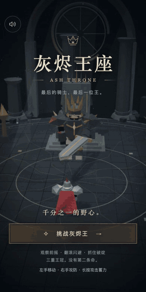

# 灰烬王座 Ash Throne

> 环形废墟王座厅里,一场三阶段的魂系 Boss 决斗:cinematic 开场、锁定视角、无敌帧翻滚、处决慢镜头。这是"大作感"的展示品——一局 3-5 分钟,不是又一个小游戏。

## 为什么这个例子重要

- **合集里最重的游戏**:完整三阶段 Boss 战、前摇电报区、无敌帧翻滚、完美翻滚判定、死亡/处决双结算卡——把"大作"的骨架塞进竖屏浏览器。
- **指定最强模型 + 最高推理档**:`gpt-6-astra` + `reasoning_effort=max`,一次构建通过全部门禁。
- **e2e 钩子内建**:游戏自带 `__combosGameplayTest`(快照 + 动作回调),验证方不用猜 canvas 状态——这是 skill 里"测试钩子藏在 query gate 后面"纪律的直接产物。
- **难度诚实**:自动化 bot 用 dash-spam 也只能活 23 秒。魂系难度是设计目标,不是缺陷。

## 文件

- [goal.md](goal.md) — 完整创作规格
- [delivery-2026-09-16.md](delivery-2026-09-16.md) — 交付报告(双分支结算、重燃链路、残余面)
- screenshots/ — 标题/战斗/死亡卡/胜利卡实拍

## 试玩

[▶ 挑战灰烬王](https://combos.game/play/aa231fec03a4e477ba35bb49b25025bc) · 分享码 `29769`

项目 ID `2100064678123753472`,部署 hash `c387bb548c268bccf1d1dfe3b0ecc17d`。
