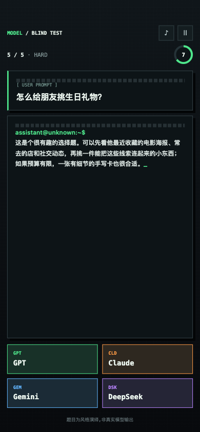
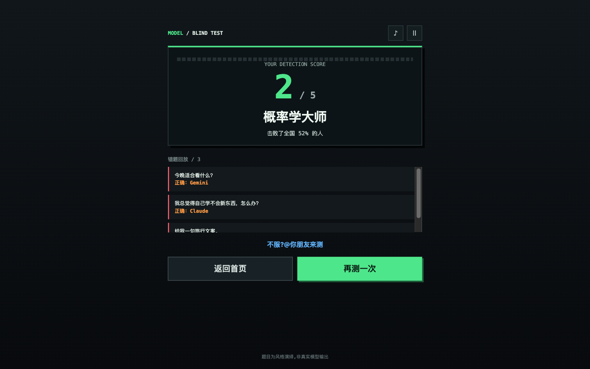
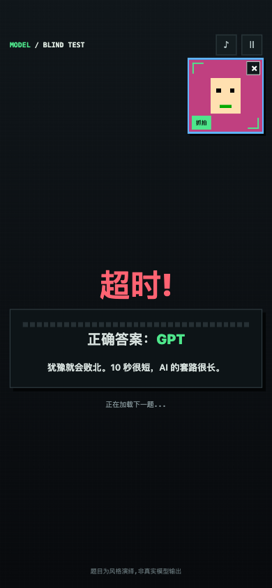
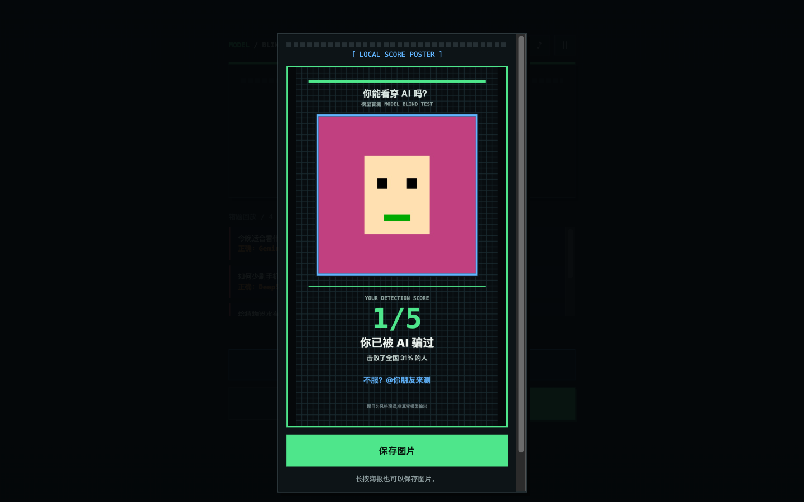

# 模型盲测 Model Blind Test

读一段 AI 风回答,猜是 GPT/Claude/Gemini/DeepSeek 谁写的。5 题一轮,第 4 题开始没人能全对——它学会了穿别人的衣服。支持全程出镜模式:右上角常驻你的实时表情,答错崩溃就是内容本身。

**公开试玩(Post 已发布)**:`https://combos.game/play/ae82cf8ef3e7931e0008b02a2a7cebae`

| 答题 | 结算 | 自拍海报 |
|---|---|---|
|  |  |  |

| 出镜模式(答题中) | 海报(桌面) |
|---|---|
|  |  |

## 传播设计

- **完播率**:答案在交互后揭晓+梗判词("三条项目符号加'总的来说',是 GPT 的经典整理术");视频形态=出题→留白 3 秒→揭晓
- **评论区**:题目自带争议("这语气绝对是 Claude"),观众互相争论=真 PK
- **认知失调**:后 2 题模仿陷阱题,错误率设计 80%+,猜错→"我居然被骗了"→拉朋友下水
- **真人出镜**:全程自拍窗 + 720×1280 自拍战绩海报(本地合成,绝不上传)
- **诚实声明**:全屏常驻"题目为风格演绎,非真实模型输出"

## 资料

- [goal.md](goal.md) — 完整创作规格(15 题题库结构 / 模仿题机制 / 称号梯度 / 验收门禁)
- [delivery-2026-08-03.md](delivery-2026-08-03.md) — 交付报告:7 个 hash 版本链、海报/出镜模式专项验证、"点了没反应"根因修复全记录
- [screenshots/](screenshots/) — 验证证据截图

## 创作过程

由 AI coding agent + [combos-game-creator skill](https://github.com/convergeai-labs/combos-skills) 驱动 Combos 平台的 Boo 编辑 agent 完成,全程浏览器自动化,7 个迭代 hash。本作包含两个值得读的事故修复:题库分布崩(一轮 4/5 同答案)和 getUserMedia 永久 pending("点了没反应")。完整过程见仓库根目录 [docs/how-built-with-agent.md](../../docs/how-built-with-agent.md)。
