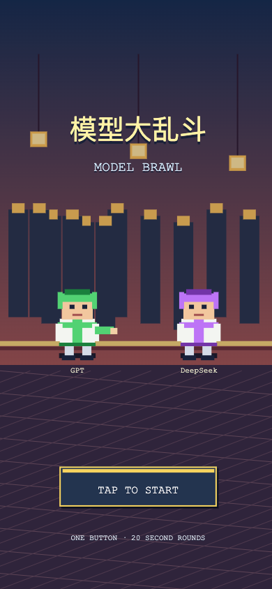
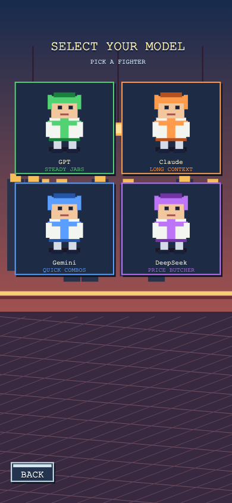
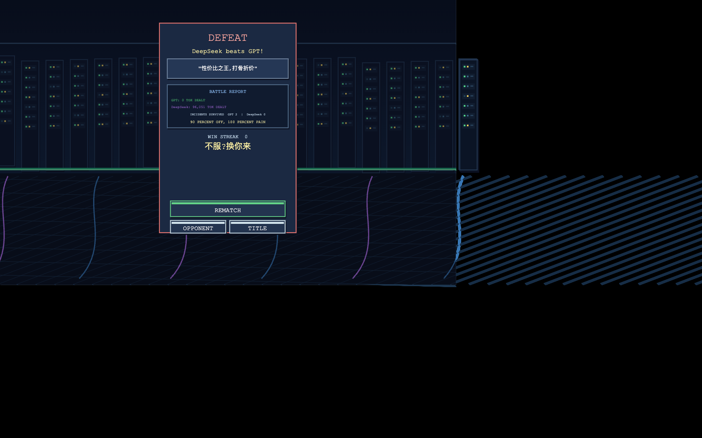
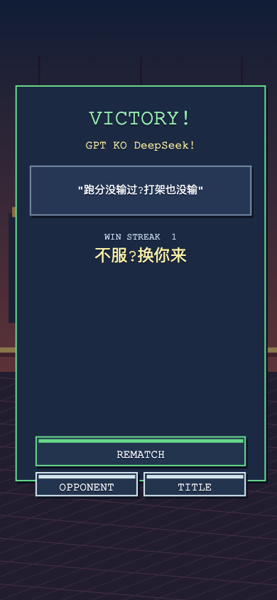
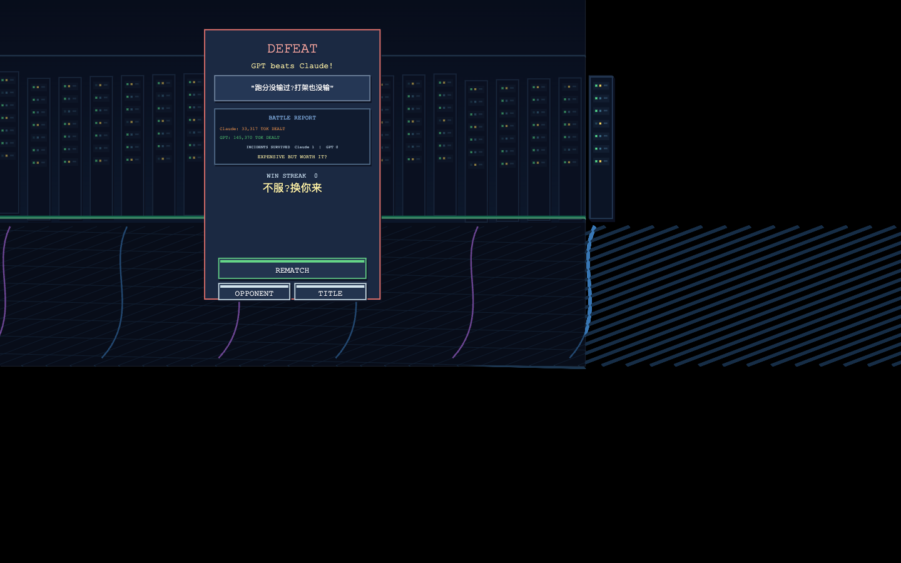

# 模型大乱斗 Model Brawl

一键 AI 模型格斗:选你押注的大模型,20 秒一局把别家模型打趴下,KO 出梗结算卡。

**试玩(preview)**:`https://combos.converge.ai/deploy/gamepreview/9f5eed603879d8c248ae5103fc1dc275/?project_id=2084127527297781760`

| 标题 | 选人 | 战斗 |
|---|---|---|
|  |  |  |

| 胜利结算 | 战报卡 |
|---|---|
|  |  |

## 传播设计

- 4 个角色 = 4 个大模型,梗数值直接写在选人页("六边形战士,但贵" / "价格屠夫");评论区天然站队"你押哪个模型?"
- 模型专属技能全是真实梗:Claude 长上下文=手长(TAI-CHI PUSH)、GPT 账单砸脸(PLUS INVOICE)、Gemini 多模态图标雨、DeepSeek 90% OFF 价格斩
- 战场随机事故:SERVER BUSY / RATE LIMIT / CONTENT MODERATED / DATACENTER OUTAGE 全屏横幅——每个横幅都是切片时刻
- HP = 真实上下文窗口 token 数(1,000,000 vs 64,000),伤害飘字 `-7,778 TOK`,结算卡 BATTLE REPORT 出引战金句

## 资料

- [goal.md](goal.md) — 完整创作规格(player fantasy / 状态机 / 验收门禁 / 排除项)
- [delivery-2026-08-03.md](delivery-2026-08-03.md) — 交付报告:9 个 hash 版本链、验收门禁全量结果、风险与教训
- [screenshots/](screenshots/) — 验证证据截图

## 创作过程

由 AI coding agent + [combos-game-creator skill](https://github.com/convergeai-labs/combos-skills) 驱动 Combos 平台的 Boo 编辑 agent 完成,全程浏览器自动化,9 个迭代 hash,每个 hash 独立浏览器验证。完整过程见仓库根目录 [docs/how-built-with-agent.md](../../docs/how-built-with-agent.md)。
