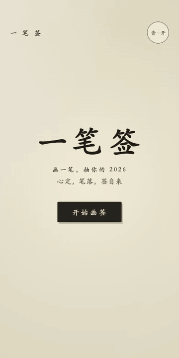

# 一笔签 One Stroke Fortune

> 国风水墨:玩家在宣纸上自由画一笔,墨迹实时晕染,提笔生成独一无二的"2026 水墨运势签"海报。一局 30 秒。

## 为什么这个例子重要

- **输入维度**:连续轨迹(画),区别于合集里其他游戏的点按/选择。
- **UGC 结构**:每张签的墨形来自玩家真实笔迹,不可复制——不需要相机也有"真人钩子"。
- **一次构建即过**:完整规格让 Boo 首版就达到全门禁通过(状态机/双视口/0 控制台错误/诚实声明)。

## 文件

- [goal.md](goal.md) — 完整创作规格(传播设计先行 + 状态机 + 验收门禁 + 排除项)
- [delivery-2026-08-25.md](delivery-2026-08-25.md) — 交付报告(构建方式、验证证据)
- screenshots/ — 标题/笔迹/签海报实拍

## 试玩

[▶ 立即抽签](https://combos.game/play/f21f5d3fc39ed46e571279e28e995ce8) · 分享码 `96120`

项目 ID `2092174013973553152`,部署 hash `8f592ff5c0129813427506392c1e2c9f`。
