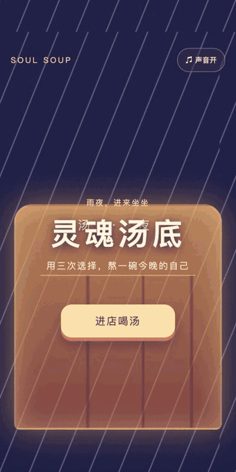

# 灵魂汤底 Soul Soup

> 暖彩水彩绘本:雨夜便利店里做 3 个温柔的选择,结尾揭晓"你的灵魂是哪种汤"水彩人格卡。一局 40 秒。

## 为什么这个例子重要

- **输入维度**:离散叙事选择,合集里第一个"无失败"游戏——冲突来自表达而非操作。
- **人格测试裂变结构**:"你是什么汤"是最古老的社交货币;6 种汤底 × 今晚限定文案,截图即状态签名。
- **内容映射可复现**:27 条路径 → 6 种汤底的确定性映射写进规格,Boo 原样实现(番茄浓汤=热烈的赤子,实测命中)。

## 文件

- [goal.md](goal.md) — 完整创作规格
- [delivery-2026-08-25.md](delivery-2026-08-25.md) — 交付报告
- screenshots/ — 标题/选择/人格卡实拍

## 试玩

项目 ID `2092174929174880256`,部署 hash `87e341e1b7df2806e7fc52582e87c913`。
公开游玩链接将在 Post 发布后补充。
